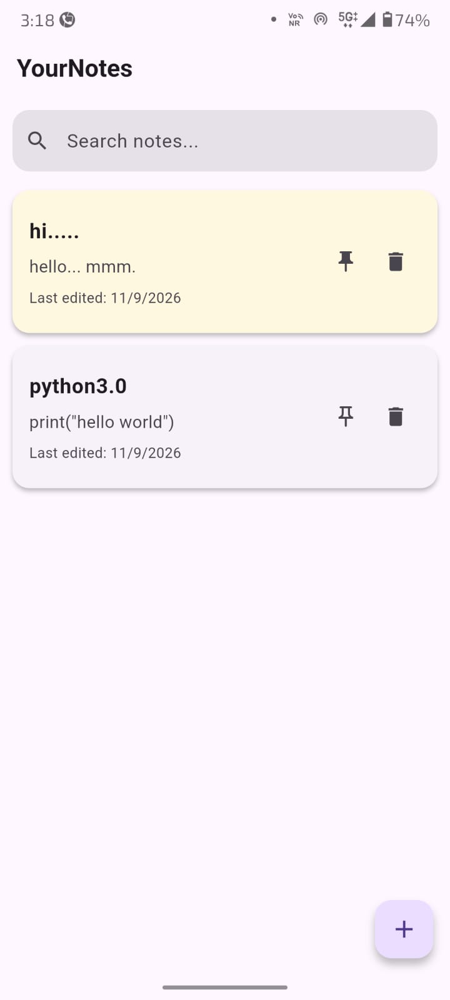
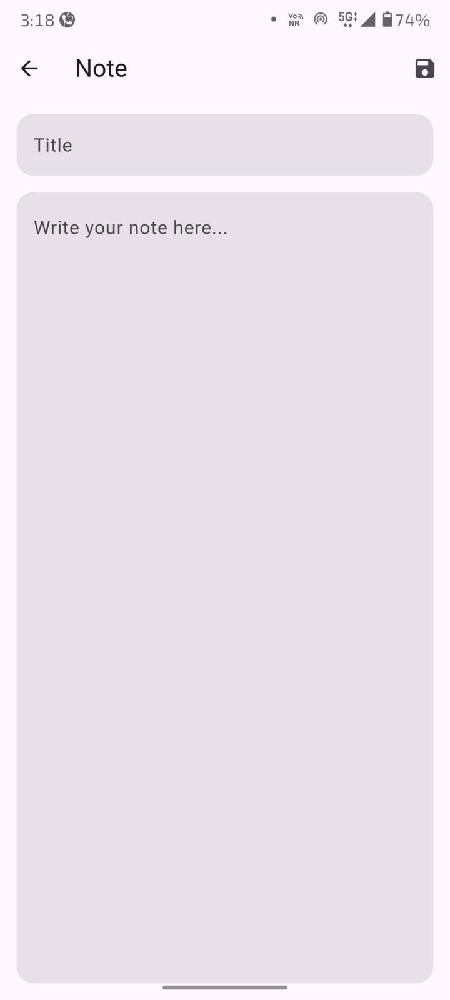
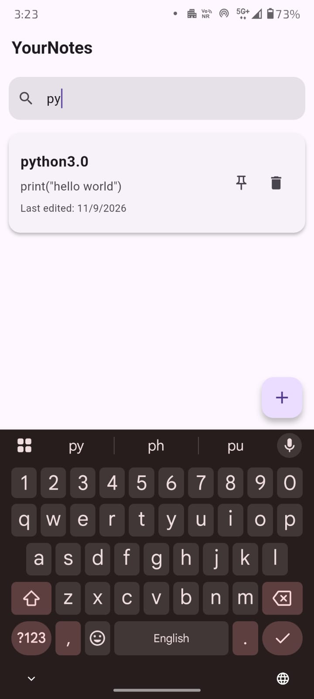
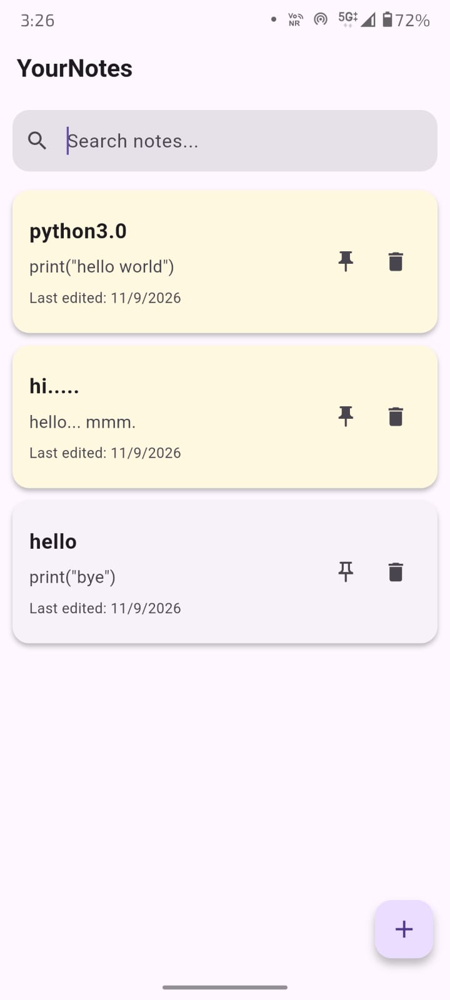
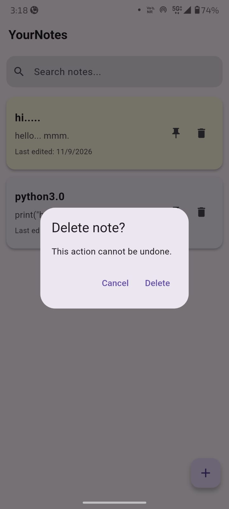
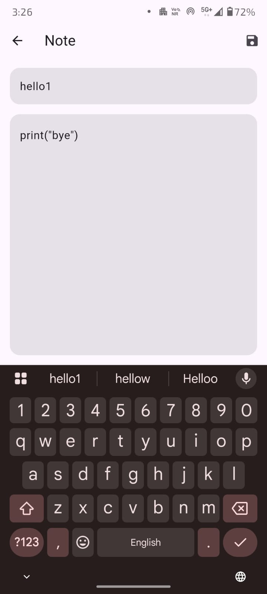

# YourNotes

YourNotes is a simple Flutter notes application that allows users to create, edit, search, pin, and delete notes.

Notes are stored locally on the device, so they remain available even after closing and reopening the app.

## Features

- Create new notes
- Add a title and content
- Edit existing notes
- Delete notes
- Search notes by title or content
- Pin and unpin notes
- Pinned notes appear at the top
- Shows the last edited date
- Persistent local storage
- Delete confirmation dialog
- Clean and simple user interface

## Screenshots

| Home | Create Note |
|------|-------------|
|  |  |

| Search | Pinned Notes |
|--------|--------------|
|  |  |

| Delete | Edit Note |
|------|-------------|
|  |  |

## Technologies Used

- Flutter
- Dart
- SharedPreferences

## Getting Started

### Prerequisites

Make sure Flutter is installed on your system.

You can check your Flutter installation by running:

    flutter doctor

### Installation

Clone the repository:

    git clone https://github.com/dev70022007/YourNotes.git

Move into the project folder:

    cd YourNotes/

Install the dependencies:

    flutter pub get

Run the application:

    flutter run

## Project Structure

    notes_app/
    ├── lib/
    │   └── main.dart
    ├── test/
    ├── android/
    ├── ios/
    ├── pubspec.yaml
    ├── pubspec.lock
    └── README.md

## Data Storage

YourNotes uses SharedPreferences to store notes locally on the device.

The notes are converted to JSON data before being saved and loaded again when the application starts.

## Future Improvements

- Dark mode
- Note categories
- Note colors
- Undo delete
- Cloud synchronization
- App lock
